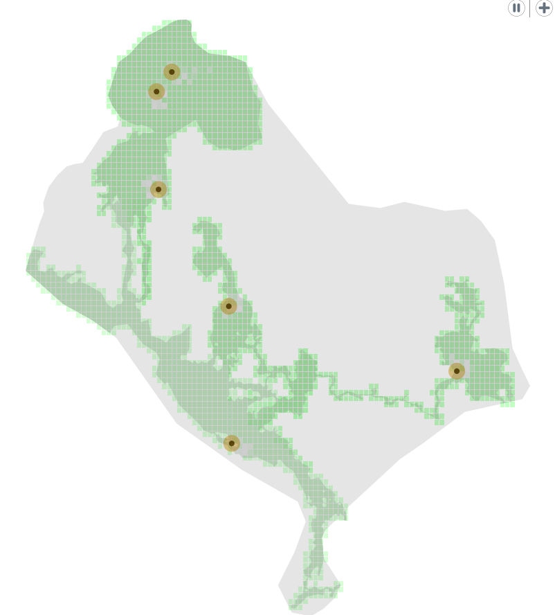

# Grazing cows

## Introduction

This agent-based model simulates the grazing behavior of cows on the Vierkaser pasture. The pasture consists of various grassland areas with different maximum biomass levels, and the cows move around, grazing on the available grass within their action radius.

## Methods

The model includes the following key components:

- Pasture areas: The Vierkaser, Hirschanger, meadow, and cutback areas are loaded from GIS data and represented as spatial entities.
- Grass: The grass in each grid cell has a biomass that regrows over time up to a maximum level, which varies based on the specific pasture area.
- Cows: The cows are placed randomly on the grassland areas and move to the best spot of grass within their action radius, grazing on the grass.

## Results

The simulation demonstrates a steady state where the cows, on average, eat as much grass as it regrows. The cows are observed moving around the pasture, grazing on the available grass, and the grass biomass remains relatively stable over time.

Simulation result after running for a few minutes (cows are represented by the brown dots with their action radius highlighted in yellow)

## Discussion

The model accurately captures the grazing behavior of cows on the Vierkaser pasture, taking into account the different grassland areas and their varying maximum biomass levels. By adjusting the parameters, such as the number of cows, the action radius, and the grass regeneration rate, the model can be used to study the impacts of different management strategies on the pasture's ecosystem.

## Conclusion

This agent-based model provides a valuable tool for understanding the dynamics of grazing on the Vierkaser pasture. The simulation can be further expanded to include additional factors, such as the impact of environmental conditions or the presence of other livestock species, to gain a more comprehensive understanding of the pasture's ecosystem.
