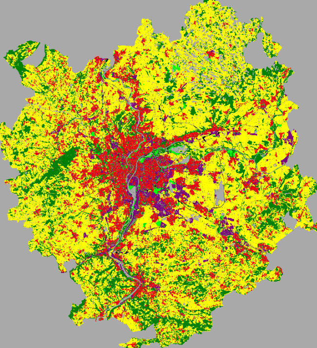

# Urban Growth Simulation - Lyon

Agent-based model simulating urban growth patterns in Lyon using Copernicus Urban Atlas data.

## Data Source

- **Land Use Data**: [Urban Atlas 2018](https://land.copernicus.eu/en/products/urban-atlas/urban-atlas-2018) (Copernicus Land Monitoring Service)

## Preprocessed Datasets

`/includes/urban_growth/2018/`

- `Full_Lyon_rasterized_100m_2018.asc` - Rasterized land use (100m resolution)
- `Full_Lyon_2018_roads_simplified.shp` - Simplified transportation network

### Land Use Classes

Classes implemented in simulation from the dataset codes:

- `11100`, `11210`, `11220`, `11230`, `11240`: Urban areas of diverse density
- `12100`: Industrial, commercial, public, military and private units
- `14100`, `14200`: Green urban areas
- `21000`, `22000`, `23000`, `24000`, `25000`: Arable lands, permanent crops, pastures, mixed cultivations, orchards
- `31000`, `32000`, `33000`: Forests, herbaceous vegetation, open spaces
- `12210`, `12220`, `12230`: Transit infrastructure

## Data Preprocessing Steps

1. **Land Use Data**:

- Download Urban Atlas 2018 data for Lyon
- Convert vector to raster (100m resolution)
- Tool: QGIS Rasterize (Vector to Raster)
- Burn value: Land use code
- Output format: ASCII grid (.asc)
- Copy into the `include` folder of the GAMA Workspace
  
2. **Transportation Network**:

- Extract roads by filtering class attribute from Urban Atlas data
- Simplify geometry
- Tool: QGIS Simplify
- Tolerance: 100m
- Export as shapefile
- Copy into the `include` folder of the GAMA Workspace

## Snapshot

## GAMA Model Structure

- Agents:
- Plots (grid cells)
- Roads network

## Usage

1. Install GAMA Platform
2. Clone repository
3. Place datasets in `/includes/`
4. Open `LyonUrbanGrowth.gaml`
5. Run experiment "raster"

## Scenarios

- **Unrestricted Urban Growth**: Low requirements for urban growth, high for green areas.
- **Controlled Urban Growth**: High requirements for urban growth, easier to maintain agricultural and natural areas.
- **Balanced Growth**: Medium requirements for all land use types.
- **Promote Green Areas**: Higher requirements for urban growth, very low for green areas.

## Project Structure

├── includes/
│   └── urban_growth/
│       └── 2018/
│           ├── Full_Lyon_rasterized_100m_2018.asc
│           ├── Full_Lyon_2018_roads_simplified.shp
└── models/
└── LyonUrbanGrowth.gaml
